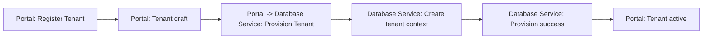
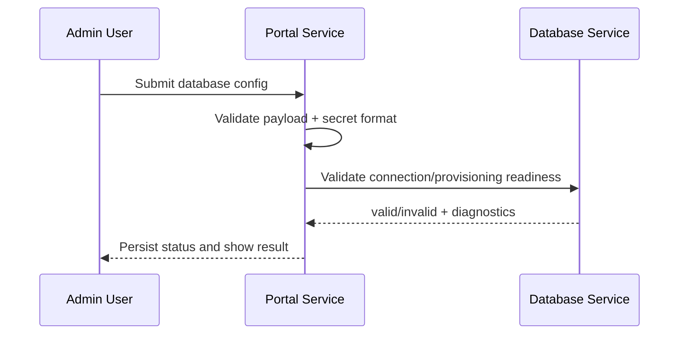

# ARCHITECTURE

## 1. System context

The platform consists of two autonomous microservices:

- **Portal Service** (Reflex/Python): manages tenant onboarding, metadata, and database connection intent.
- **Database Service** (Python API + SQLite in-memory initially): hosts tenant-scoped operational data and enforces domain invariants.

The Portal is an orchestration and administration boundary. The Database Service is the source of truth for transactional restaurant domain data.

---

## 2. Responsibilities and boundaries

### Portal Service (Reflex)

**Owns**
- Tenant registration workflow
- Admin-facing UI/state management
- Database configuration request/validation workflow
- Invocation of Database Service provisioning endpoints

**Must not own**
- Order/payment/tab transactional business rules
- Direct writes to domain tables of the Database Service

### Database Service

**Owns**
- Tenant-scoped domain entities (`Tenant`, `User`, `DatabaseConfig`, `Unit`, `Table`, `Tab`, etc.)
- Data consistency and lifecycle invariants
- Persistence abstractions and adapters
- Tenant isolation at query and repository boundaries

**Must not own**
- UI rendering concerns
- Portal-specific state/session behavior

---

## 3. Current repository assessment (technical debt and smells)

1. **Architecture mismatch**: root docs referenced a previous SQL Server + React framing, not the current Reflex + SQLite target.
2. **Lack of module boundaries**: no service-level directories or explicit ownership map.
3. **Mixed domain maturity**: detailed entity notes exist, but are not translated into enforceable service contracts.
4. **Configuration ambiguity**: `.env.example` and compose files were tied to SQL Server and did not reflect current initial runtime assumptions.
5. **No lifecycle specification**: onboarding/provisioning flows were not normalized into state transitions.

---

## 4. Proposed service-level architecture

## 4.1 Portal Service internal layers

- `ui/`: Reflex pages/components and state handlers.
- `domain/`: use-cases (`RegisterTenant`, `ValidateDatabaseConfig`) and domain DTOs.
- `infrastructure/`: HTTP client to Database Service, auth/token adapters, retries.
- `config/`: environment loading and typed settings.

## 4.2 Database Service internal layers

- `api/`: REST handlers/controllers and request validation.
- `domain/`: entities, aggregates, value objects, invariants.
- `persistence/`: repositories and DB session abstraction.
- `infrastructure/`: telemetry, logging, queue/event adapters.
- `config/`: runtime settings and feature toggles.

---

## 5. Tenant lifecycle

Recommended lifecycle states:

1. `draft`: tenant record created in Portal, not yet provisioned.
2. `provisioning`: Portal triggers Database Service tenant bootstrap.
3. `active`: tenant is reachable and passes connectivity + schema checks.
4. `suspended`: temporarily disabled due to billing/policy/system rules.
5. `archived`: soft-retired tenant, immutable except compliance operations.

### Lifecycle transitions

- `draft -> provisioning`: valid registration payload accepted.
- `provisioning -> active`: Database Service confirms schema/context creation.
- `active -> suspended`: policy/billing/ops trigger.
- `suspended -> active`: reactivation process.
- `active/suspended -> archived`: long-term decommission.

---

## 6. Database connection strategy

### Initial phase (in-memory SQLite)

- Single runtime process storage, volatile by design.
- Tenant isolation done via strict `tenant_id` filtering and repository guardrails.
- Useful for rapid development and contract validation.

### Near-term upgrade path

- Move from in-memory SQLite to file-based SQLite for restart survivability in dev.
- Introduce migration framework and seed strategy.
- Evolve to managed relational DB (e.g., PostgreSQL) with same repository contracts.

### Isolation recommendation

- **V1**: shared schema + mandatory `tenant_id` in all tenant-owned entities.
- enforce:
  - tenant-aware middleware/context injection
  - repository methods requiring `tenant_id`
  - composite unique constraints including `tenant_id`

---

## 7. Domain and data modeling

## 7.1 Primary entities (minimum)

- `Tenant`: organizational boundary and lifecycle state.
- `User`: operator identity scoped to tenant.
- `DatabaseConfig`: requested/validated connection metadata and status.
- `Unit`, `Area`, `Table`: operational floor topology.
- `Tab`, `Order`, `OrderItem`, `Payment`: transactional POS domain.

## 7.2 Relationship principles

- Every tenant-owned entity must include `tenant_id`.
- Financial facts are immutable snapshots (`OrderItem.unit_price_snapshot`).
- Mutable catalogs (`Product`, `Category`) must not rewrite history.
- State transitions should be explicit and auditable (`changed_by`, `changed_at`, optional `reason`).

---

## 8. Key flows

## 8.1 Tenant registration and provisioning

1. Portal receives registration request.
2. Portal creates tenant in `draft` state.
3. Portal submits provisioning command to Database Service.
4. Database Service initializes tenant context.
5. Portal marks tenant `active` after successful confirmation.

## 8.2 Database config validation

1. Admin submits database config via Portal.
2. Portal performs syntactic validation and secret handling.
3. Portal requests connectivity validation from Database Service.
4. Database Service reports result and health metadata.
5. Portal stores `DatabaseConfig.status = valid|invalid` with diagnostics.

## 8.3 Transactional example (tab flow)

1. Open tab (`Tab: open`).
2. Add/send orders (`Order: draft -> sent`).
3. Snapshot line items (`OrderItem`).
4. Register/confirm payments.
5. Close tab when due amount reaches zero.

---

## 9. Mermaid diagrams (ready-to-use)

---

## 10. Naming and structure recommendations

- Use explicit suffixes for intent:
  - commands: `register_tenant_command.py`
  - use-cases: `register_tenant_use_case.py`
  - repositories: `tenant_repository.py`
- Avoid generic folders such as `utils` for domain logic.
- Keep API contracts versioned (`api/v1/...`).
- Keep service-private docs in each service root + cross-service docs at repository root.

---

## 11. Immediate backlog

1. Generate service skeletons under `services/portal` and `services/database`.
2. Define initial OpenAPI contract for provisioning + health.
3. Implement tenant context middleware in Database Service.
4. Add architecture decision records (ADRs):
   - tenancy model
   - persistence migration strategy
   - cross-service authentication.
