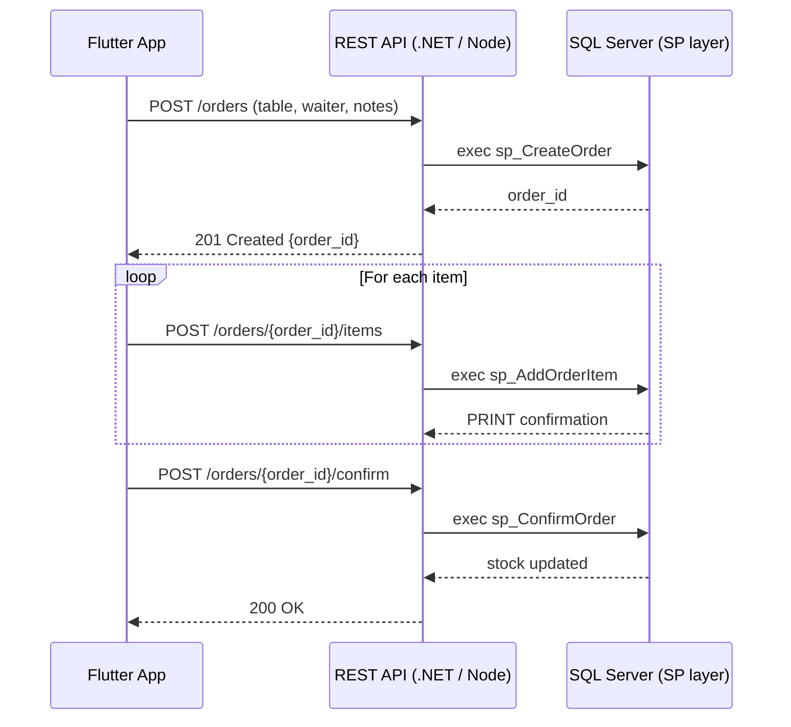

## 0 · Vision & Scope

| Theme           | Decision                                                        | Why it matters                                                       |
| --------------- | --------------------------------------------------------------- | -------------------------------------------------------------------- |
| **App type**    | Flutter (clean architecture, Riverpod/BLoC)                     | Cross-platform, testable layers                                      |
| **Comms style** | REST + JSON over HTTPS                                          | Simpler than GraphQL, plays well with generated Retrofit/Dio clients |
| **API tier**    | ASP.NET Core 8 (Web API) or Node 18 (Fastify)-with-TypeScript   | Native SQL Server support & middleware ecosystem                     |
| **DB access**   | Call Stored Procedures only                                     | Enforces all business rules in one place                             |
| **AuthN/Z**     | JWT (access + refresh); role claims: *waiter, cashier, manager* | Secures every request, keeps Flutter stateless                       |
| **Hosting**     | Azure App Service + Azure SQL (or AWS Fargate + RDS)            | Managed scaling, built-in TLS                                        |

---

## 1 · Domain Requirements ⇒ API Services

| Functional Area                                           | Minimum Endpoints                                                                                     | Key SPs / Views                                                                                 |
| --------------------------------------------------------- | ----------------------------------------------------------------------------------------------------- | ----------------------------------------------------------------------------------------------- |
| **Catalog** (recipes, additions, ingredients, categories) | `GET /catalog/recipes` • `POST /catalog/recipes` • `PATCH /catalog/recipes/{id}`                      | `sp_InsertRecipe*`, `sp_GetRecipe*`                                                             |
| **Stock**                                                 | `GET /inventory/levels` • `POST /inventory/restock`                                                   | `vw_IngredientesAbaixoEstoqueMinimo`, `sp_InsertIngredient`                                     |
| **Orders / Commandas**                                    | `POST /orders` • `POST /orders/{id}/items` • `POST /orders/{id}/confirm` • `POST /orders/{id}/cancel` | `sp_CreateOrder`, `sp_AddOrderItem`, `sp_AddOrderAddition`, `sp_ConfirmOrder`, `sp_CancelOrder` |
| **Invoices / Payments**                                   | `POST /invoices` • `GET /invoices/{id}`                                                               | `sp_GenerateInvoice` *(to write)*                                                               |
| **Staff**                                                 | `POST /auth/login` • `GET /staff/me` • `POST /staff/workhours`                                        | `sp_InsertEmployee`, `sp_InsertWorkHours`                                                       |

---

## 2 · Data-flow Contract

> **Tip**: Return only lightweight DTOs; Flutter keeps a local cache to render instantly, then refreshes in background.

---

## 3 · OpenAPI First

1. **Design** a YAML spec (`openapi.yaml`) with:

   * Global JWT security scheme.
   * Tags = functional areas above.
2. **Generate**:

   * Type-safe Retrofit or Chopper client for Flutter (`openapi-generator-cli`).
   * Controller & model stubs for the API tier.
3. Keep the spec versioned—DB changes map to new schemas, never breaking existing clients.

---

## 4 · Backend Implementation Checklist

| Layer              | Task                                                                                      |
| ------------------ | ----------------------------------------------------------------------------------------- |
| **Controllers**    | Thin; parameter validation, claim extraction, call `Service` layer.                       |
| **Services**       | Wrap each stored procedure; map to DTOs.                                                  |
| **DAL**            | Re-use a single connection pool; always call SPs with **command type = StoredProcedure**. |
| **Error Handling** | Global exception filter → JSON `{code, message}`.                                         |
| **Logging**        | Serilog / Pino; correlate `order_id` in logs with `TraceId`.                              |
| **Unit Tests**     | Mock DB  verify service logic; integration tests run in Docker with SQL Server.          |

---

## 5 · Flutter Implementation Checklist

| Layer            | Task                                                                      |
| ---------------- | ------------------------------------------------------------------------- |
| **Data sources** | Generated client + interceptors (JWT injection, retry).                   |
| **Repositories** | One per domain; convert DTO → domain model.                               |
| **State**        | Riverpod providers; optimistic updates for fast UI.                       |
| **UI**           | Material 3 + Tailwind-like design; offline banner when connectivity lost. |
| **Caching**      | `hive` or `sqflite` for last-known catalog and active orders.             |
| **Testing**      | Widget tests for flows (create order, edit, confirm).                     |

---

## 6 · Security & Ops

| Concern           | Resolution                                         |
| ----------------- | -------------------------------------------------- |
| **TLS**           | Terminated at load balancer; force HTTPS.          |
| **CORS**          | Whitelist mobile bundle IDs & web origins.         |
| **Rate limiting** | Sliding window per JWT & IP.                       |
| **Back-ups**      | Point-in-time restore on Azure SQL or AWS RDS.     |
| **Monitoring**    | Application Insights / CloudWatch; track slow SPs. |

---

## 7 · Milestones & Timeline (example)

| Week | Deliverable                                      |
| ---- | ------------------------------------------------ |
| 1    | Finalize OpenAPI spec + DB SP set (v1).          |
| 2    | Scaffold API project, plug SP calls, basic auth. |
| 3    | Flutter data layer & login flow.                 |
| 4    | Order-capture UI, confirm/cancel flows.          |
| 5    | Inventory alerts + invoice generation.           |
| 6    | Pilot on staging, feedback, hardening.           |
| 7    | Production release 🍻                            |
